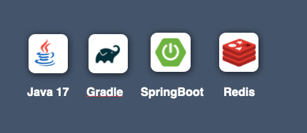

## 📖 고정 윈도 카운터 알고리즘 구현 API

---

- 대규모 트래픽 4장 **“처리율 제한 장치 설계”** 에 소개된 **고정 윈도 카운터 알고리즘**을 구현한 API입니다.

<br/>

## 🛠️ 사용 SW

---



<br/>

## 🏢 아키텍처 구조

---


```
├── common 패키지
│    └── config 패키지
│          └── RedisConfig.class
│
│    └── dto 패키지
│          └── ExceptionResponse.class
│    └── exception 패키지
│          └── BusinessException.class
│          └── CommonException.class
│          └── CommonExceptionCode.enum
│          └── ExceptionCode.interface
│          └── GlobalExceptionHandler.class
│
├── Controller 패키지
│    └── FixedWindowCounterController.class
│
├── dto 패키지
│    └── response 패키지
│          └── FixedWindowCounterResponse.class
│          └── FixedWindowCounterResponseList.class
│
├── exception 패키지
│    └── RateException.class
│    └── RateLimitExceededException.enum
│
├── service 패키지
│     └── FixedWindowCounterService.class
│ 
└──  FixedwindowcounterApplication.class

```

<br/>

## ✏️ API 설명

---

### 1️⃣ 고정 윈도 카운터 생성 API
- 고정 윈도 카운터 생성 API는 고정 윈도 카운터 알고리즘을 구현한 API입니다.
- 고정 윈도 카운터 생성 API는 요청을 받으면 Redis에 고정 윈도 카운터를 생성하고 요청 횟수를 증가시킵니다.
- 각 카운터는 고유한 **윈도 기간(60초)** 동안 유효하며, 이 기간 내의 요청 수를 카운트합니다.
- 요청 수가 **고정된 최대 요청 허용 수(1000회)** 를 초과하면, 요청은 제한됩니다.
- 요청이 성공적으로 처리되면, 현재 요청 카운터의 키와 요청 수를 반환합니다.


``` Http
post /fixed-window-counter
```
<br/>

### 2️⃣ 고정 윈도 카운터 조회 API
- 생성된 고정 윈도 카운터의 정보를 조회하는 API입니다.
- **모든 유효한 고정 윈도 카운터의 키와 해당 키의 요청 수를 조회할 수 있습니다.**
- **Redis에서 고정 윈도 카운터를 스캔하여, 각 카운터의 현재 요청 수와 함께 반환**합니다.

``` Http
GET /fixed-window-counter
```